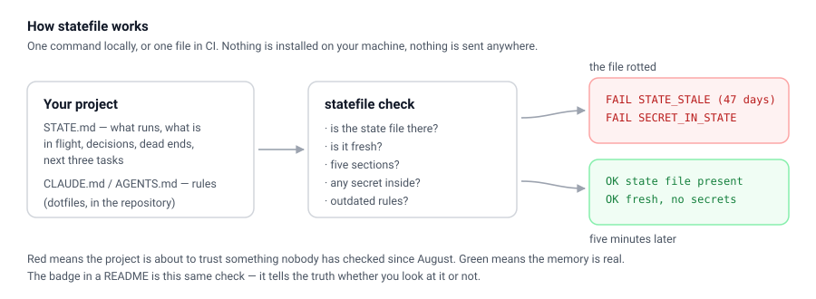

# The project that forgot

A real, small project — a price checker that runs every morning — six weeks after the last time anyone wrote down what it was doing.

This repository is **red on purpose**. The check is failing, and every failure in it is a mistake real projects make:

| What the check found | What it means in real life |
|---|---|
| `STATE_STALE` — not touched in 47 days | The file that is supposed to tell your assistant where the project stands has been lying since August |
| `STATE_SECTIONS` — missing: dead ends, next | Nobody wrote down what was already tried and killed, and nobody wrote down what happens next |
| `SECRET_IN_STATE` — unfilled template | A deploy placeholder went into the state file, and from there it drifts into commits |
| `RULE_ANTIPATTERN` ×3 | The instruction file still asks the model to `double-check` and `think step by step` — patterns current models don't need |

[](https://github.com/exodus611/statefile-demo/actions/workflows/statefile.yml)
[](https://github.com/exodus611/statefile-demo/actions/workflows/statefile.yml?query=branch%3Afixed)

The first badge is this repository. The second is the same repository on the `fixed` branch.

**See exactly what changed:** [`compare/main...fixed`](../../compare/main...fixed) — four edits, about five minutes of work.

---

## What is this, in one paragraph

`statefile` is one file you drop next to your project. It checks that the project's **AI memory** is real: that the state file exists, that it is fresh, that it has the five sections that make it useful, that no secret leaked into it, and that your instruction files have not drifted back into patterns written for older models. No dependencies, no accounts, no server, nothing is sent anywhere.

## What this repository actually contains

```
app.py              a tiny price checker (this is the "real project")
STATE.md            what the project knows about itself — six weeks old
CLAUDE.md           the rules the assistant reads
.github/workflows/  the check, running on every push
```

## The failure, verbatim

Run it yourself on this branch:

```bash
git clone https://github.com/exodus611/statefile-demo
cd statefile-demo
curl -sO https://raw.githubusercontent.com/exodus611/statefile/main/statefile.py
python3 statefile.py check
```

```
state file: STATE.md
[WARN] STATE_SECTIONS: STATE.md is missing sections: dead ends, next
         fix: Add the missing headings, even as placeholders.
[FAIL] STATE_STALE: STATE.md has not changed in 47 days (limit 14).
         fix: Update it before the next session, or raise --max-age-days.
[FAIL] SECRET_IN_STATE: unfilled template value at STATE.md:24 — deploy: {{ secrets.DEPLOY_TOKEN }}
         fix: Remove it and rotate the value. Never keep secrets in a state file.
[WARN] RULE_ANTIPATTERN: CLAUDE.md:3 — verification ritual: the model already self-corrects — Always double-check your work before responding.
         fix: Delete the line, or say what you want done instead of how hard to try.
[WARN] RULE_ANTIPATTERN: CLAUDE.md:5 — reasoning scaffold: frontier models reason natively — Think step by step.
         fix: Delete the line, or say what you want done instead of how hard to try.
[WARN] RULE_ANTIPATTERN: CLAUDE.md:7 — pressure language: turns into noise, not signal — CRITICAL: YOU MUST ALWAYS run the full test suite before every commit and never
         fix: Delete the line, or say what you want done instead of how hard to try.
result: failed
```

Exit code 1. In CI that is a red X on the commit page, and anyone can open the log and read the same lines.

## The fix

Four edits on the `fixed` branch — nothing clever:

1. `STATE.md`: write down the dead ends (`"cron inside the web app — jobs died silently on every deploy"`) and the next three tasks.
2. `STATE.md`: drop the template line and keep secrets in the deployment settings where they belong.
3. `CLAUDE.md`: delete the three outdated lines and add one that matters — *read `STATE.md` first, update it before the session ends*.
4. Touch the state file — because a state file nobody touches is a state file that lies.

```
result: clean
```

## Use it on your own project

```bash
python3 statefile.py init --path /path/to/your/project   # draft a STATE.md
python3 statefile.py check --path /path/to/your/project  # is the memory real?
```

To make it run by itself, drop `.github/workflows/statefile.yml` into your repository:

```yaml
name: statefile
on: [push, pull_request, workflow_dispatch]
jobs:
  check:
    runs-on: ubuntu-latest
    steps:
      - uses: actions/checkout@v4
      - uses: exodus611/statefile@main
        with:
          max-age-days: '14'
```

That is the whole setup. From then on the badge in your README tells the truth about your project's memory, whether you look or not.

---

## How it works



Your project keeps two files that matter to an assistant: **state** (`STATE.md`) and **rules**
(`CLAUDE.md`). The check reads them and the surrounding git history — it never walks your code,
never installs anything and never sends anything anywhere. It runs by hand in one command, or in
CI on every push, which is what produces the badge above.

---

*The tool: [exodus611/statefile](https://github.com/exodus611/statefile). The method behind it — rules versus state, and the three levels of checking that keep a state file from rotting into confident nonsense — is in **Never Start from Scratch**: <https://exodus611.github.io/>.*
